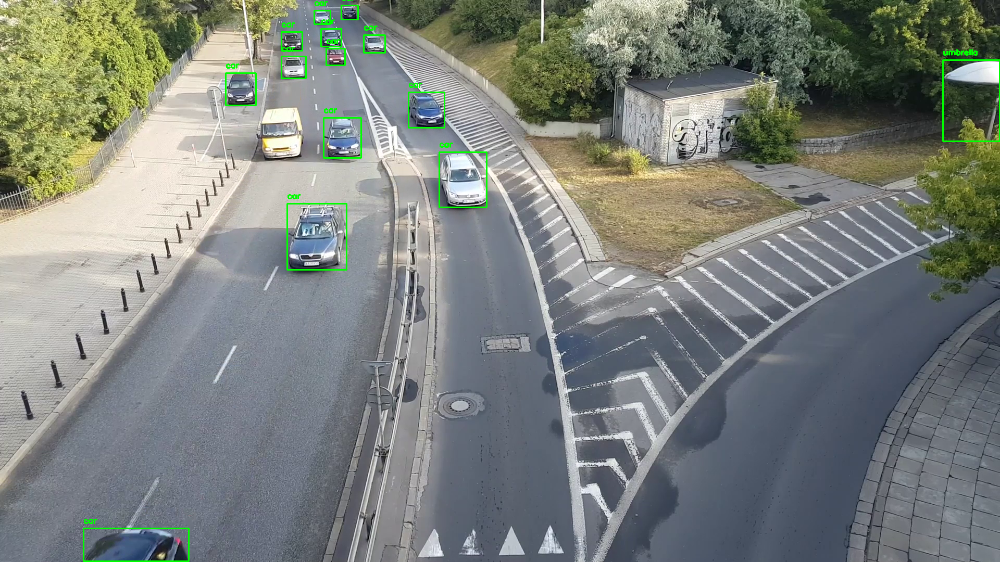
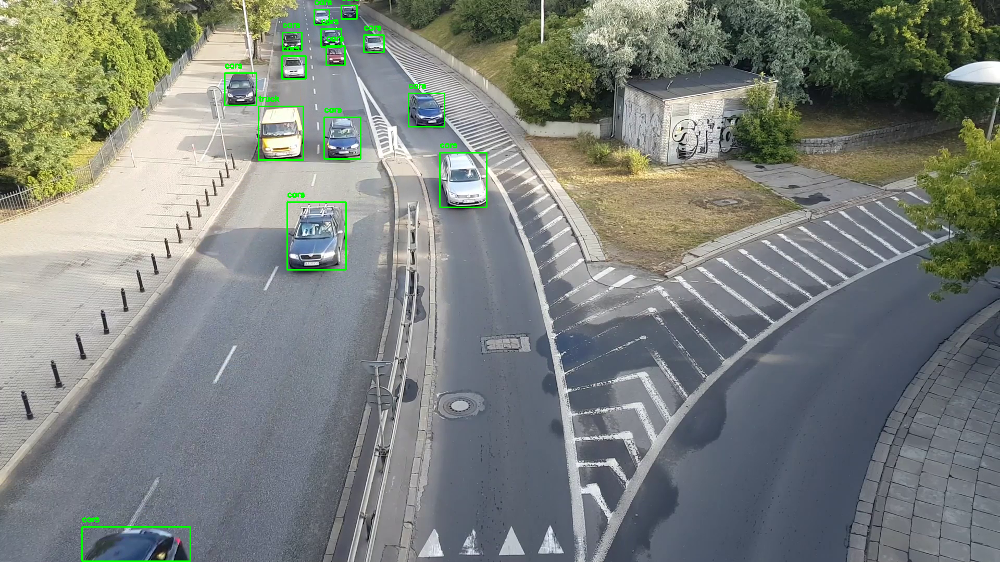

# Object-Detection
## Overview
Trained the model [yolov8l](https://docs.ultralytics.com/models/yolov8/#performance-metrics) using [Roboflow](https://roboflow.com/) to detect cars in video [frames]([images](https://www.kaggle.com/datasets/trainingdatapro/cars-video-object-tracking)) in order to see the entering and exiting frame of a certain car. 
## Results
In this [folder](results) there are files that show how the model works on data from [examples](examples) and how many cars and trucks the pre-trained model yolov8l got in [vehicle_count](results/vehicle_count.txt) vs the same model trained with data from roboflow in [vehicle_count_trained](results/vehicle_count_trained.txt)

Examples from output:
* pre-trained:
  
* trained with roboflow:
  
